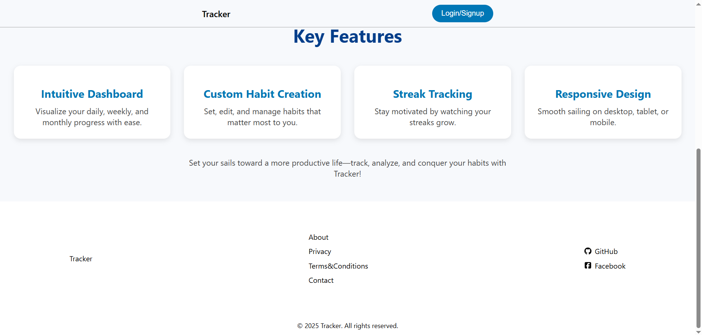

# Habit Goal Tracker MERN App

## Overview

- This app helps to add, delete, update habits and track them on daily basis, all functionalities are not yet implemented. Work is in Progress!!!

## How to run

- run `npm install` in root, frontend, backend
- run `npm run dev` in root to start application.
- `env` add variablesmin this **Port, MongoDB URL, JWT_SECRET, EMAIL, PASSWORD** or you can look for 'process.env.___' ___ -> variable name
- If error you can look for root `package.json` and find "dev": "concurrently \"cd frontend && npm start\" \"cd backend && nodemon main.js\" "

## Features

- Add, Update, Delete, Visualize Habits
- Update user details, theme preference.

## Technology Used

1. BACKEND 
- JWT (Authentication)
- JOI
- CORS
- Role Based Access (Authorization)
- Full CRUD Operations for habits
- Filtering
- Nodemailer to notify users

2. Frontend
- React Calendar
- Responsive Design
- Switch theme
- Admin and User Pages
- Notify users
- Lazy loading

## Notes

- Ensure node_modules are installed individually in:
    - Root (/)
    - Frontend (/frontend)
    - Backend (/backend)

## Work in progress

- Update Habit details (Date)
- Notify all Inactive users (Admin)

## Future Scope

1. Email verification using `Nodemailer`
2. Use of **Cookies**, **Session Storage** - for persistent and secure sessions
3. Caching - to improve **Performance**
4. 

## Live Demo link

[View the live website](https://habitgoaltracker-1.onrender.com)

## Screenshots

### Home Page

### Authentication Page

### User Pages

### Admin Pages

